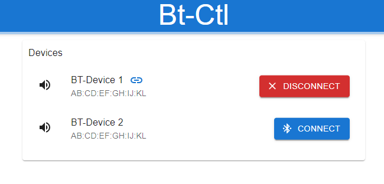

# SonicLume
Elevate your audio-visual experience with our all-in-one platform that seamlessly syncs sound-reactive LED strips to your music over AirPlay using LedFX, transforming any space with vibrant, dynamic light displays.

## Overview
This project aims to close the gap of streaming your music to bluetooth speakers and visualizing the audio stream via LedFx.
Essentially you'll be streaming your music instead via AirPlay to your server, which in turn forwards the audio to a bluetooth speaker while also using it as an input to LedFX. A simple web application is also included to easily connect your bluetooth device to the server.

## Prerequisites
A linux-based machine with:
- Bluetooth
- bluez and bluez-utils
- PulseAudio
- Docker(-compose)

## Ports
- shairport-sync (used for AirPlay): port 8888/udp,tcp
- bluetooth-control web app: 8080/tcp
- LedFx web app: 8080/tcp

## Config
- bluetooth-control and LedFx ports: docker-compose.yml
- AirPlay device name: config/shairport.conf

## Usage
1. Clone this repo on your server.
2. Run `start.sh`.
3. Go to `http://<your-server-address>:8080/` and connect your bluetooth device. LedFx and Shairport should start now.  

  

4. Go to `http://<your-server-address>:8888/` to access the LedFx web-ui and configure your led-strips. Refer to the [LedFx Docs](https://github.com/ledfx/ledfx) on how to do that.
5. Start playing music via AirPlay device "AirPi" (or whatever you called it).
